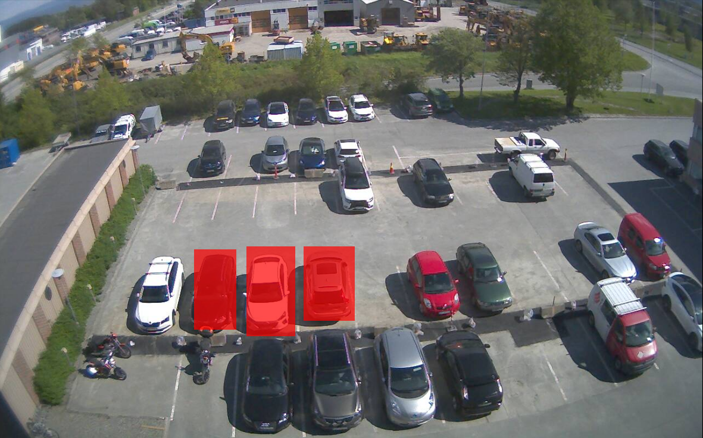

# image_segmentation

This repository contains the toolbox for image segmentation, which is built primarily for the final project of the Computer Vision course at TU Delft. The project concerns the classification of parking space occupancy detection using a simplified AlexNet, or mAlexNet. Please refer to CV_Project for more details.

### Setting up
From a website called [Inescam](https://www.insecam.org/), we download snapshots of a surveillance camera in a parking lot in Trondheim, Norway using the shell script [get_img.sh](sample/get_img.sh). The file can be added to `cron` to schedule the execution of the file. In this dataset, a time interval of 15 minutes was set to download the snapshot. The downloaded file is named after the following format: 2020-06-08_13.30_no.jpg, as in 8th June 2020 at 13:30, Norway. 

### Flow

<p align='center'>
  
</p>

The order of operation is listed as follows, when you have:

1. a new image to segment and you want to CREATE a segmentation MASK.
2. a segmentation mask to use and you want to SAVE segmented images using that mask.
3. segmented images and want to LABEL them.

Please note : 
    a) this toolbox only accepts files in jpg format.
    b) the jpg files should be named in the format of `YYYY-MM-DD_hh.mm.jpg`.

### Functions
By running the `main.py` function, 3 options will present where user can choose from one of the actions mentioned above.


### Requirements
```
python3
numpy
matplotlib
opencv-python
pickle
```
